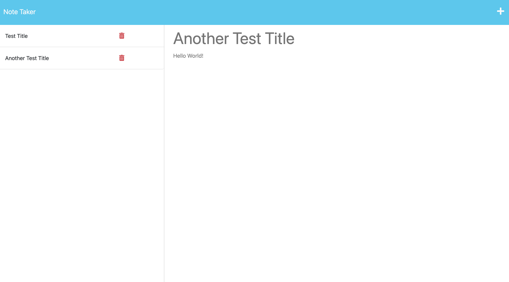
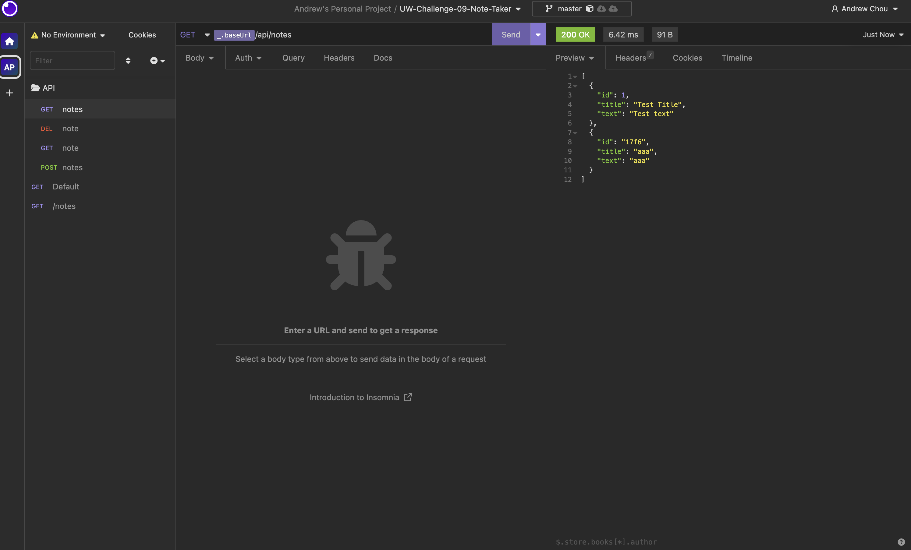

# Andrew's Note Taker

## 🔎 Overview:
> * Express.js project
>
> * Use "npm i" to install dependencies. Then use "node index" to start the server. Or use "npm run nodemon" for dev
>
> * Using express@4.16.4 for building API & nodemon@2.0.20 for dev
>
> * Implement HTTP GET, POST, DELETE methods
>
> * Deployed on Heroku

> **Note**: No HTTP PUT method. Unique Id generator and validator can be implemented in the future.
>


## 🎬 Link Of The Website:
❗❗❗ ☛ [Clik Me To The Page!](https://whispering-retreat-81775.herokuapp.com/) ☚ ❗❗❗

```
Website's URL: 
https://whispering-retreat-81775.herokuapp.com/
(hosted on heroku)
```

## 📷 Screenshots Of The Applications:

||
|:--:| 
| *Sample of the generated webpage* |

||
|:--:| 
| *Prompted questions* |

||
|:--:| 
| *Passed all unit tests* |

||
|:--:| 
| *Short tutorial* |
- - -
© 2023 edX Boot Camps LLC. Confidential and Proprietary. All Rights Reserved.
